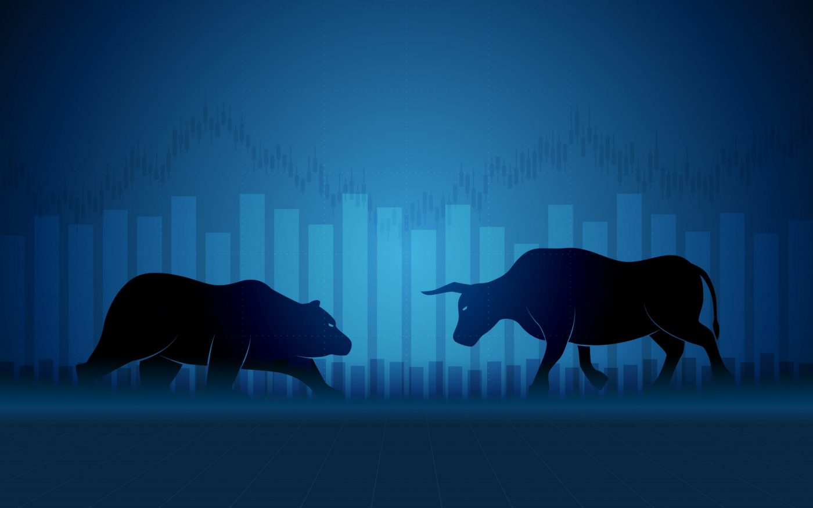
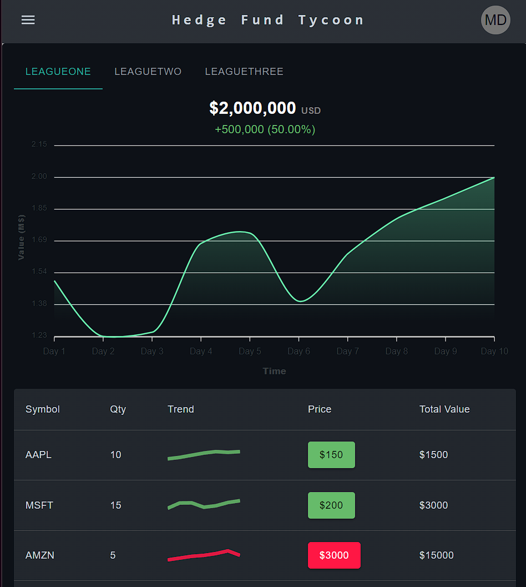
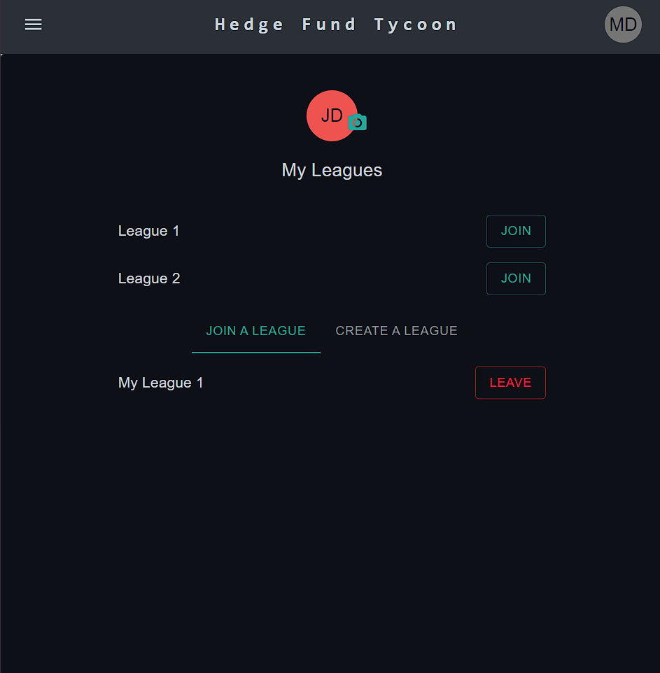
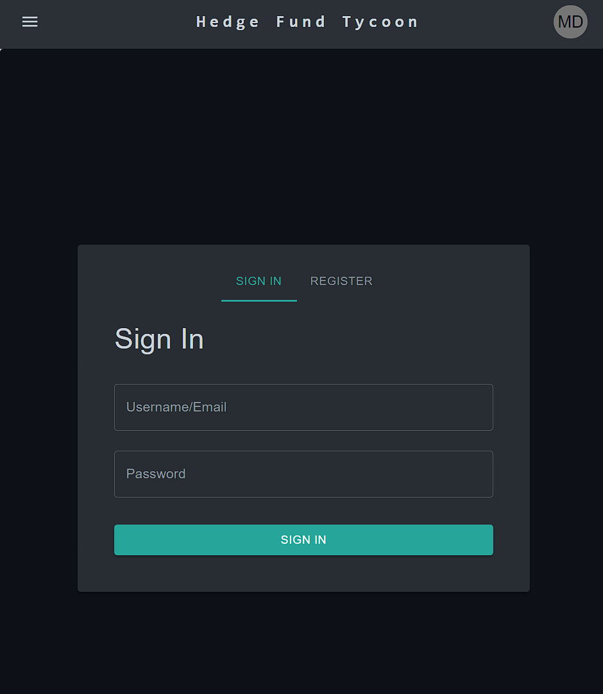

# Hedge Fund Manager (HFM) Web Application

## Overview

Hedge Fund Manager is an interactive web application that allows users to participate in simulated stock trading competitions within created leagues. Users can join or create leagues, manage portfolios, and trade various assets including stocks, currencies, commodities, and cryptocurrencies. The application offers a realistic trading environment with features like real-time market data and simulated market scenarios.

## Technologies Utilized

  
  
  
  
  
  
  
  

## Current Screenshots

### Data and API Integration
- **Financial Market Data API**: Used for fetching real-time financial data (to be integrated).
- **Python Scripts**: Custom scripts for data handling, such as importing stock data and generating simulated market scenarios.

## Application Features

### Pages
- **Rules Page**: Explains the game mechanics and rules. Features a simple, user-friendly design with the game's logo.
- **League Page**: Displays a bar graph of user portfolio values, a line chart of portfolio value changes over time, and a rankings table.
- **Portfolio Page**: Shows a line chart of the user's portfolio value, a pie chart for asset allocation, and a table with detailed asset information. Includes transaction functionalities.
- **Market Page**: Enables users to search for stocks, view their performance, and trade. Offers a customizable time range for viewing stock performance.

### User Interaction
- **Account Creation and Management**: Users can create accounts to participate in leagues and manage their portfolios.
- **League Participation**: Users can join or create leagues with specific trading rules and asset limitations.
- **Trading Simulation**: Real and simulated trading environments, including Monte Carlo and hybrid models for price prediction.

### Future Implementations
- **Oauth2, New Asset Types, ML driven bots, Improved UI & Plotting**

